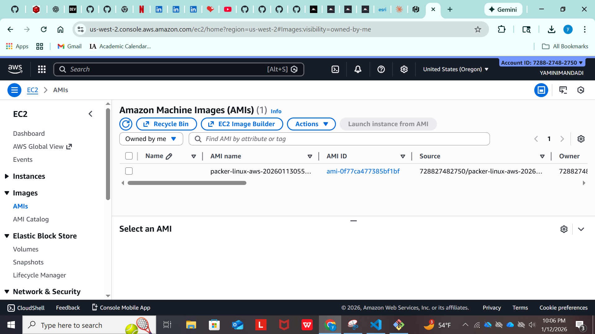
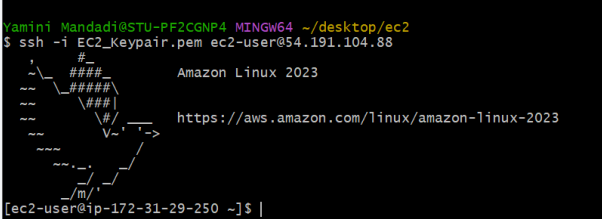

# Packer AMI Builder with Apache Web Server

This project automates the creation of custom Amazon Machine Images (AMIs) using HashiCorp Packer. The resulting AMI includes a pre-configured Apache HTTP server that displays custom content.

## 📋 Prerequisites

Before you begin, ensure you have the following:

- **AWS Account** with appropriate IAM permissions
- **AWS CLI** installed and configured
- **Packer** installed (version 1.2.8 or higher)
- **Terraform** (optional, for infrastructure deployment)
- Valid AWS credentials configured locally

### Required IAM Permissions

Your AWS user/role needs the following permissions:
- EC2: CreateImage, DescribeImages, RunInstances, TerminateInstances
- EC2: CreateSecurityGroup, AuthorizeSecurityGroupIngress
- EC2: CreateKeyPair, DeleteKeyPair


## 🚀 Quick Start

### 1. Clone or Create Project Directory

```bash
mkdir packer-ami-project
cd packer-ami-project
```
## 📁 Project Structure

```
packer-ami-project/
├── webserver.pkr.hcl      # Packer configuration template
├── install_httpd.sh       # Apache installation script
├── main.tf                # Terraform infrastructure (optional)
├── ami_manifest.json      # Generated AMI details (after build)
└── README.md              # This file
```

### 2. Create Required Files

Create the following files in your project directory:

- `webserver.pkr.hcl` - Packer configuration template
- `install_httpd.sh` - Apache installation script
- `main.tf` - Terraform configuration (optional)

### 3. Configure AWS Credentials

```bash
aws configure
```

Enter your AWS Access Key ID, Secret Access Key, and default region.

### 4. Initialize Packer

```bash
packer init .
```

### 5. Validate Configuration

```bash
packer fmt .
packer validate webserver.pkr.hcl
```

### 6. Build the AMI

```bash
packer build webserver.pkr.hcl
```

The build process takes approximately 4-5 minutes.


## 🔧 Configuration

### Packer Template (`webserver.pkr.hcl`)

Key configuration parameters:

- **Region**: `us-west-2` (modify as needed)
- **Instance Type**: `t3.micro` (free tier eligible)
- **Base AMI**: Amazon Linux 2023
- **SSH Username**: `ec2-user`

To change the region or instance type, edit these lines:

```hcl
source "amazon-ebs" "al2023" {
  instance_type = "t3.micro"       # Change instance type here
  region        = "us-west-2"      # Change region here
  # ... rest of configuration
}
```

### Installation Script (`install_httpd.sh`)

The script performs the following actions:
1. Updates system packages
2. Installs Apache HTTP Server
3. Starts and enables Apache service
4. Creates a custom HTML page displaying the AMI ID

## 🖥️ Deploying EC2 Instances


```bash
# Get your AMI_ID="ami-xxxxxxxxx" from the build output(ami_manifest.json in the artifact_id)
{
  "builds": [
    {
      "name": "al2023",
      "builder_type": "amazon-ebs",
      "build_time": 1768284294,
      "files": null,
      "artifact_id": "us-west-2:ami-0f77ca477385bf1bf",
      "packer_run_uuid": "ae5ebd34-f056-7110-dd68-7bc94bc3b0a0",
      "custom_data": null
    }
  ],
  "last_run_uuid": "ae5ebd34-f056-7110-dd68-7bc94bc3b0a0"
}
```


Use the provided `main.tf` configuration:

```bash
terraform init
terraform plan
terraform apply
```

Update the AMI ID in `main.tf`:

```hcl
resource "aws_instance" "ec2" {
  ami = "ami-xxxxxxxxx"  # Replace with your Packer-built AMI ID
  # ... rest of configuration
}
```

## 🔐 SSH Access

### Connect to Your Instance

```bash
# SSH to the instance
ssh -i EC2_Keypair.pem ubuntu@<PUBLIC_IP>
```


**Note**: For Amazon Linux 2023 AMIs, use `ec2-user` instead of `ubuntu`:

```bash
ssh -i EC2_Keypair.pem ec2-user@<PUBLIC_IP>
```


## 🧹 Cleanup

To avoid unnecessary AWS charges:

### 1. Terminate EC2 Instances
```
# Using Terraform
terraform destroy
```

### 2. Deregister AMI

Deregister the AMI if no longer needed:


**Built with ❤️ using HashiCorp Packer**